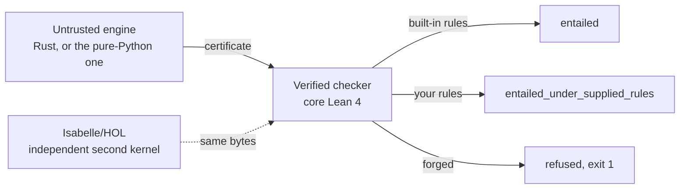

<!-- mcp-name: io.github.fabio-rovai/open-ontologies -->

<p align="center">
  
</p>

<h1 align="center">Open Ontologies</h1>

<p align="center">
  <strong>Plan a change to a production ontology, see every consequence before you apply it,<br>
  and hand the reviewer a proof they can check without trusting you.</strong><br>
  Written in Rust. Ships as a single binary.
</p>

<p align="center">
  <a href="https://tesseractsemantics.com"><strong>tesseractsemantics.com</strong></a>
</p>

<p align="center">
  <a href="https://tesseractsemantics.com"></a>
  <a href="https://github.com/fabio-rovai/open-ontologies/stargazers"></a>
  <a href="https://github.com/fabio-rovai/open-ontologies/actions/workflows/ci.yml"></a>
  <a href="LICENSE"></a>
  <a href="https://github.com/fabio-rovai/open-ontologies/pkgs/container/open-ontologies"></a>
  <a href="https://github.com/sponsors/fabio-rovai"></a>
</p>

<p align="center">
  <strong>English</strong> · <a href="README.zh-CN.md">简体中文</a>
</p>

<p align="center">
  <a href="https://open-ontologies-try.vercel.app/?sample=epc-sample.csv&auto=1"><strong>Try it in the browser</strong></a>: drop one spreadsheet, get one ontology with the evidence for every line, then break a cell and watch the shape catch it. The page runs the pinned release binary; nothing is reimplemented.
</p>

<p align="center">
  <a href="https://tesseractsemantics.com"><b>Building this into a platform &rarr; tesseractsemantics.com</b></a><br>
  <sub>The engine is MIT and stays that way. The platform is the hosted, governed version of it.</sub>
</p>

---

<p align="center">
  
</p>

<p align="center">
  <sub><b>426 asserted, 259 certified, 1 rejected.</b> Green edges the engine derived and a Lean 4
  checker then <i>proved</i>. The red edge is a forged line the same checker refused, exit 1, with
  the rule named. Every count is taken from the run, not written into the caption.</sub>
</p>

<p align="center">
  
</p>

<p align="center">
  <sub><b>The same machinery on someone else's file, twice, because HQDM ships as two files.</b>
  <code>hqdmTop/hqdmFramework</code> publishes an RDFS rendering, vendored byte for byte by MagmaCore, and
  <code>gchq/HQDM</code> an OWL one, and they fail different checks. The RDFS file carries no
  <code>owl:</code> term and no disjointness axiom, so <i>no named class in it can be unsatisfiable</i>; it has
  <b>23</b> terms used as a class and never declared, <b>12</b> <code>rdfs:range</code> declarations naming a
  relation rather than a class, and <b>13</b> pairs of names one trailing underscore apart, three of them
  identical in domain and range. The OWL file passes all three checks and is not coherent: this engine's
  tableaux finds <b>195</b> of its named classes satisfiable and cannot decide <b>39</b>, and HermiT, an opinion
  in this repository's vocabulary, calls exactly those <b>39</b> unsatisfiable. Nothing here was proved and the
  figure does not say it was; every count, including that intersection, is recomputed by a test. Provenance
  and method in <a href="docs/assets/hqdm/PROVENANCE.md"><code>docs/assets/hqdm/PROVENANCE.md</code></a>.</sub>
</p>

### One triple. Nothing added, nothing removed, blast radius zero. 901 consequences that were not there before.

```
$ printf 'load base.ttl\nplan proposed.ttl\n' | open-ontologies batch -
#   the whole change:  ex:hasParent rdfs:domain ex:Person

added_classes         0
removed_classes       0
blast_radius          0 triples affected
risk_score            low
                      ────────────────────────────────────────────
conservativity        not_conservative_under_rule_table
new consequences      901          rule table owl-rl, in 0.04s
```

Every number a shape diff can produce says this change is harmless. It retyped
every individual the property already had. **That gap is what this is for**, and
it is the part `git diff` cannot do, because the change is a single well-formed
line and the text diff is one line long.

**Then hand the reviewer the proof.** The run writes a certificate a third party
re-verifies months later, with no running instance of this software and no
network: `oo-cert asserted.tsv derivations.tsv`, exit 0, covered by
`OOCert.certificate_sound`.

**And it refuses a forged one.** Edit a conclusion into the derivation file and
the same checker exits 1 and names the rule that does not hold. That is the red
edge above, and it is the exhibit that makes the first two beats survive
scrutiny rather than the headline.

> **This is not an ontology editor.** If you want to draw class hierarchies, use
> Protégé. This is what you run on the change before it reaches production.
>
> **Terraform-style, and deliberately so, but the plan is semantic rather than
> syntactic.** A text diff is `git diff`, and you already have that.

No JVM. No Protégé. Speaks MCP to Claude, Cursor and anything else that talks
to it.

## See it in action

<p align="center">
  
</p>

Three triples in, three out. `ex:Northwind` was only ever asserted to be in a sanctioned
jurisdiction; that it needs enhanced due diligence was *derived*, and the derivation is checkable by
someone who does not trust you, your engine, or the model that wrote the ontology.

The last few seconds are the part worth watching. One conclusion is forged, both of its premises are
left exactly as they were, and the same checker refuses it and names the rule. Every line in that
terminal is output `oo-horn` actually printed for the fixtures in
[`tests/fixtures/horn/supplier/`](tests/fixtures/horn/supplier), and a test re-runs the checker and
fails if the picture and the checker ever disagree.

## With a proof, and without one

The same query, answered by an ordinary reasoner and by this one.

| | An ordinary reasoner | Open Ontologies |
| --- | --- | --- |
| The answer | `Northwind needs enhanced due diligence` | the same answer |
| Why it holds | "the reasoner said so" | a certificate naming every rule and premise |
| Who can check it | nobody, short of rerunning the same engine | anyone, with a checker that shares no code with the engine |
| If the engine has a bug | you get a wrong answer, confidently | the checker rejects it, exit 1 |
| If someone edits the output | undetectable | rejected, with the line and rule named |
| If a rule was yours, not the standard's | reported identically | a different verdict word, enforced by a test |
| What an auditor receives | a screenshot | a file they can re-verify themselves |
| Guarantee on an unsatisfiability answer | asserted | **none, and it says so** |

That last row is the point of the whole project. Where something is measured rather than proved, the
tool says measured; where a prover's opinion is an opinion, it never borrows the checker's
vocabulary. [What is proved, and what is not](#what-is-actually-proved).

## What it does

| Capability | What you get |
| --- | --- |
| Reason over OWL and RDFS | Materialised inferences **and** a derivation certificate a proved checker accepts |
| Bring your own rules | SWRL, RIF Core or a Horn table, evaluated, with a verdict word that says they were yours |
| Validate against SHACL | A report from an evaluator measured against the W3C suite, not just asserted to pass |
| Ask if something is satisfiable | A finite model, replayed and checked, rather than a yes |
| Ask if something is inconsistent | A refutation where one is certifiable, and an honest engine opinion where it is not |
| Retrieve a slice for RAG | Per-claim entailment preservation, because 99% coverage can still drop the one triple that mattered |
| Change an ontology in production | Plan, blast radius, risk score, locked IRIs, apply, monitor, drift, rollback |
| Load real data | CSV, JSON, XML, YAML, XLSX, Parquet, PostgreSQL and DuckDB into RDF |
| Hand it to a prover | TPTP, CLIF, SMT-LIB and LADR from one translation, with what it cannot export named and counted |
| Work from an assistant | An MCP server, so Claude or Cursor drives all of it in conversation |

## Try the checker itself

The three files are in the repository, and the output below is what the checker printed, trimmed to
the fields that matter.

```bash
$ cd lean && lake build            # builds the checkers, core Lean 4, no Mathlib
$ F=../tests/fixtures/horn

$ lake exe oo-horn check $F/builtin_rules.tsv $F/asserted.tsv $F/good.tsv
{"ok":true,"verdict":"entailed","theorem":"OOCert.entails_of_builtin_horn",
 "means":"every conclusion is true in every model of the asserted graph"}

$ lake exe oo-horn check $F/builtin_rules.tsv $F/asserted.tsv $F/bad_conclusion.tsv
{"ok":false}                        # one IRI in the conclusion changed. exit 1.

$ lake exe oo-horn check $F/user_rules.tsv $F/asserted.tsv $F/good.tsv
{"ok":true,"verdict":"entailed_under_supplied_rules","theorem":"OOCert.horn_certificate_sound"}
```

The third line is the one that matters. Same inference, but one of the rules was written by you,
so it is an assumption the certificate carries and not a fact it establishes. The verdict word
changes, and a test fails if it ever stops changing.



## Run it on your own ontology

Those fixtures ship with the repository. Here is the same thing starting from a file you wrote.
[Install](#install) is below; this takes about a minute.

```bash
mkdir /tmp/oo-demo && cd /tmp/oo-demo
cat > coffee.ttl <<'EOF'
@prefix ex:   <http://example.org/> .
@prefix rdfs: <http://www.w3.org/2000/01/rdf-schema#> .

ex:Espresso rdfs:subClassOf ex:Coffee .
ex:Coffee   rdfs:subClassOf ex:Drink .
ex:myCup    a               ex:Espresso .
EOF

export OPEN_ONTOLOGIES_STORAGE_MODE=persistent          # in-memory by default, see below
open-ontologies --data-dir /tmp/oo-demo/store load coffee.ttl
open-ontologies --data-dir /tmp/oo-demo/store reason --profile rdfs --certificate ./cert
```

Three triples in, three out: the cup is a Coffee, the cup is a Drink, and Espresso is a subclass of
Drink. Any RDFS reasoner does that much. The difference is the directory it just wrote.

```bash
lake exe oo-cert /tmp/oo-demo/cert/asserted.tsv /tmp/oo-demo/cert/derivations.tsv
{"ok":true,"asserted":3,"derivations":3,"theorem":"OOCert.certificate_sound"}
```

Now lie to it. Leave the premises alone and forge one conclusion, claiming the cup is a Beer:

```bash
cp -r /tmp/oo-demo/cert /tmp/oo-demo/forged
sed -i '' 's|example.org/Drink>\t<http://example.org/myCup>|example.org/Beer>\t<http://example.org/myCup>|' \
  /tmp/oo-demo/forged/derivations.tsv     # GNU sed: drop the '' after -i
lake exe oo-cert /tmp/oo-demo/forged/asserted.tsv /tmp/oo-demo/forged/derivations.tsv
```

```json
{"ok":false,"asserted":3,"derivations":3,"first_rejected":2,"rule":"rdfs9",
 "conclusion":"<http://example.org/myCup> <...#type> <http://example.org/Beer>",
 "premises":["<http://example.org/myCup> <...#type> <http://example.org/Coffee>",
             "<http://example.org/Coffee> <...#subClassOf> <http://example.org/Drink>"]}
```

Exit 1, the offending line numbered, the rule named, and the premises shown so you can see for
yourself that they do not support it.

### What the proof actually looks like

Two tab-separated files, 1.3 KB for the run above. `asserted.tsv` is what you claimed:

```
<ex:myCup>      <rdf:type>          <ex:Espresso>
<ex:Coffee>     <rdfs:subClassOf>   <ex:Drink>
<ex:Espresso>   <rdfs:subClassOf>   <ex:Coffee>
```

`derivations.tsv` is one line per step: the rule, then the conclusion, then the premises it used.

```
rdfs9    <ex:myCup> <rdf:type> <ex:Coffee>              <ex:myCup> <rdf:type> <ex:Espresso>        <ex:Espresso> <rdfs:subClassOf> <ex:Coffee>
rdfs11   <ex:Espresso> <rdfs:subClassOf> <ex:Drink>     <ex:Espresso> <rdfs:subClassOf> <ex:Coffee> <ex:Coffee> <rdfs:subClassOf> <ex:Drink>
rdfs9    <ex:myCup> <rdf:type> <ex:Drink>               <ex:myCup> <rdf:type> <ex:Coffee>          <ex:Coffee> <rdfs:subClassOf> <ex:Drink>
```

That is the whole proof. No model, no network, no vendor. A checker walks it, re-derives each
conclusion from its own premises under the named rule, and confirms every premise is either asserted
or concluded by an **earlier** line. Anyone can write one; ours is the one with a soundness theorem.

### Who checks it, and when

The certificate is a file, so the answer is whoever holds the file, whenever they like.

| Who | When | What they run |
| --- | --- | --- |
| You, in the loop | every run, before trusting an answer | `lake exe oo-cert` alongside the reasoner |
| A reviewer | when a change lands | the same command in CI, on the artefact the run wrote |
| An auditor, months later | long after the engine has moved on | the same command, on the archived files |
| Another agent | on receiving a claim from one it does not trust | the same command, before acting on it |

Nothing is streamed and nothing phones home. The engine and the checker share bytes on disk, not a
protocol, which is what makes the last two rows possible at all: an auditor re-checking a claim next
year needs the two files and a Lean build, not a running instance of this software.

What the certificate does **not** carry is which graph it came from. It proves the conclusions follow
from the assertions listed in it; it cannot tell you those assertions are the ones in your database.
That gap is [issue #158](https://github.com/fabio-rovai/open-ontologies/issues/158) and it is open. Showing a green result would prove nothing, since anything can
print `ok`. The point is that it goes red.

Two defaults that will bite you otherwise. Storage is in-memory unless
`OPEN_ONTOLOGIES_STORAGE_MODE=persistent` is set, so `load` followed by `reason` starts from an empty
store and cheerfully certifies nothing; the tool warns, and the warning is easy to skim past. And
`--data-dir` is a flag rather than an environment variable, so a demo without it writes into
`~/.open-ontologies` beside real work.

The discipline behind all of this is not free and it has earned its keep:
[what the rules are, and what each has caught](docs/decisions/).

## What is actually proved

| You ask | You get back | Checked against |
| --- | --- | --- |
| Reason over OWL | A derivation certificate | `OOCert.certificate_sound` |
| Reason with rules you wrote | A certificate, and a different verdict word | `OOCert.horn_certificate_sound` |
| Is this satisfiable | A finite model | `Dl.satisfiable_of_checkModel` |
| Is a solver's model real | The model, replayed | `Fol.satisfiable_of_check` |
| Is this inconsistent | A refutation | `OOCert.refutation_sound` |
| Does this data fit the shapes | A validation report | `Shacl.validate_spec` |
| Does a retrieval slice still support the answer | Per-claim preservation | `OOCert.certificate_sound` |

That last row is the one to read twice. A retrieval slice at 99% coverage can have dropped the
one triple an answer depends on, and one at 60% can preserve every claim that matters. Coverage
is a proxy that rises as the slice grows, so a retriever tuned on it learns to fetch more rather
than the right thing. Entailment preservation is the property, it is decidable here, and it
carries a certificate per claim. See [decision 0007](docs/decisions/0007-a-slice-preserves-a-conclusion-or-it-does-not.md).

Measuring the loss is the second-best answer. The best one is a subset that cannot lose anything,
and `onto_module_extract` computes one: a syntactic locality module over a signature, where every
entailment of the whole ontology over those terms is still an entailment of the subset. That
guarantee is a theorem of Cuenca Grau, Horrocks, Kazakov and Sattler, JAIR 31 (2008), and it is
CITED rather than machine-checked, because nothing under [lean/](lean/) is about locality. The
report says exactly that, names no theorem of this project, and offers to measure the consequence
instead: reason the ontology and the module to a fixpoint and report every conclusion over the
signature the module does not reach. On this repository's own pizza ontology that is 238 of 1,345
axioms, and zero lost out of 2,583 differences examined. `onto_conservative_check` is the same
machinery pointed at the lifecycle: does adding these axioms change any consequence over the names
the ontology already used? See
[decision 0011](docs/decisions/0011-a-module-carries-a-theorem-and-a-slice-carries-a-measurement.md).

## Install

```bash
# macOS (Apple Silicon)
curl -LO https://github.com/fabio-rovai/open-ontologies/releases/latest/download/open-ontologies-aarch64-apple-darwin
chmod +x open-ontologies-aarch64-apple-darwin && mv open-ontologies-aarch64-apple-darwin /usr/local/bin/open-ontologies

# Linux (x86_64)
curl -LO https://github.com/fabio-rovai/open-ontologies/releases/latest/download/open-ontologies-x86_64-unknown-linux-gnu
chmod +x open-ontologies-x86_64-unknown-linux-gnu && mv open-ontologies-x86_64-unknown-linux-gnu /usr/local/bin/open-ontologies

# Docker
docker pull ghcr.io/fabio-rovai/open-ontologies:latest

# From source (Rust 1.85+)
cargo build --release --features embeddings,plugins,sql
```

Intel macOS, native Windows and the rest: [docs/quickstart.md](docs/quickstart.md) and
[docs/windows.md](docs/windows.md).

`serve` starts an MCP server speaking JSON-RPC over stdin and stdout, so on launch it appears to
hang while it waits for a client. That is expected. From a terminal, use the CLI subcommands
instead, such as `open-ontologies validate <file.ttl>`.


## Connect it to Claude

Add to `~/.claude/settings.json` for Claude Code, or to
`~/Library/Application Support/Claude/claude_desktop_config.json` for Claude Desktop:

```json
{
  "mcpServers": {
    "open-ontologies": {
      "command": "/path/to/open-ontologies",
      "args": ["serve"]
    }
  }
}
```

Restart, and the `onto_*` tools are available. Cursor, Windsurf, Zed and VS Code are in
[docs/quickstart.md](docs/quickstart.md).

## Stars

<a href="https://star-history.com/#fabio-rovai/open-ontologies&Date">
  
</a>

## What is in the box

**One loop:** `plan` a change, `apply` it, watch for `drift`, `certify` what was
derived, `rollback` when it was wrong. That is the whole of the front page, and
it is what this is for.

Everything else — alignment, embeddings, PDDL planning, clinical crosswalks, the
plugin marketplace, CIVeX — has its own documentation and keeps its own code. It
is listed once, in [docs/tool-reference.md](docs/tool-reference.md), and not
here. Surface area is not the argument.

A few tools need an optional Cargo feature and return an error without it: four
need `embeddings`, two need `plugins`, two need `postgres` or `duckdb`. The
published binaries and the GHCR image are built with the default feature set, so
they do not carry those eight.

The Python package `open-ontologies-lite` now reasons as well, in pure Python with no Rust
toolchain, and its certificates are checked by the same Lean binaries. It is a second engine, and
being untrusted costs nothing: the warrant was never in the engine.

`tools/horn_differential.py` runs both engines and the Lean checker over every RDF document the
repository tracks. **The two engines are not independent**: they run the same algorithm over the
same rule table and the Python's comments cite the Rust by file and line, so their agreement is
strong evidence against a transcription slip and close to none against a shared misreading of a
W3C rule. The independent leg is the Lean checker. The tool prints that caveat next to its
agreement count on every run, and
[docs/lean-certificates.md](docs/lean-certificates.md#known-limitations) states it as a limitation.

Alongside them, a marketplace of 33 standard ontologies, clinical crosswalks, semantic embeddings,
a lineage audit trail, and a desktop Studio with a virtualized ontology tree, an AI chat panel and
a Protégé-style inspector. No JVM. No Protégé.

## Documentation

| Topic | Link |
| --- | --- |
| Quickstart | [docs/quickstart.md](docs/quickstart.md) |
| Architecture | [docs/architecture.md](docs/architecture.md) |
| Derivation certificates and the Lean checkers | [docs/lean-certificates.md](docs/lean-certificates.md) |
| Which axioms a conclusion rests on, and provenance semirings | [docs/explanation.md](docs/explanation.md) |
| What the Lean proofs assume about the Rust | [docs/trusted-computing-base.md](docs/trusted-computing-base.md) |
| Aeneas at the Rust/Lean boundary: what it proves, and what it costs | [docs/aeneas-boundary.md](docs/aeneas-boundary.md) |
| Which gates a green CI tick actually ran | [docs/ci-gates.md](docs/ci-gates.md) |
| First-order export, TPTP and Common Logic | [docs/first-order-export.md](docs/first-order-export.md) |
| Every reasoning system, and why each was used or refused | [docs/reasoning-systems-inventory.md](docs/reasoning-systems-inventory.md) |
| Design decisions, one rule per file | [docs/decisions/](docs/decisions/) |
| SHIQ reasoning | [docs/reasoning.md](docs/reasoning.md) |
| Schema alignment | [docs/alignment.md](docs/alignment.md) |
| Data pipeline | [docs/data-pipeline.md](docs/data-pipeline.md) |
| Ontology lifecycle | [docs/lifecycle.md](docs/lifecycle.md) |
| Locality modules and conservative extensions | [docs/modules-and-conservativity.md](docs/modules-and-conservativity.md) |
| Semantic embeddings | [docs/embeddings.md](docs/embeddings.md) |
| Clinical crosswalks | [docs/clinical.md](docs/clinical.md) |
| IES support | [ecosystem](docs/ies-ecosystem.md) · [alignment](docs/ies-alignment.md) · [SPARQL examples](docs/ies-examples.md) |
| Benchmarks | [docs/benchmarks.md](docs/benchmarks.md) |
| Determinism and corrected results | [docs/determinism.md](docs/determinism.md) |
| Windows | [docs/windows.md](docs/windows.md) |
| Contributing | [CONTRIBUTING.md](CONTRIBUTING.md) |

## Open Ontologies for teams

The engine in this repository is MIT licensed and will stay that way. What it does not give you is
somewhere to put the evidence: a place where certificates are kept, where a change to an ontology is
reviewed before it ships, and where an auditor can re-verify an answer months later without
installing anything.

That is what [**tesseractsemantics.com**](https://tesseractsemantics.com) is being built for. If you
are running ontologies where a wrong answer costs something, it is worth a conversation.

<p align="center">
  <a href="https://tesseractsemantics.com"><b>tesseractsemantics.com &rarr;</b></a>
</p>

## Stack

Rust edition 2024, single binary, no JVM. Oxigraph 0.5 for RDF and SPARQL 1.1. `rmcp` for MCP over
streamable HTTP. SQLite for state, lineage and feedback. Lean 4 v4.33.1 for the checkers, core Lean
only, no Mathlib. Tauri 2, React 19 and Tailwind 4 for the Studio. Full table in
[docs/architecture.md](docs/architecture.md).

## Citation

- **Open Ontologies: Tool-Augmented Ontology Engineering with Stable Matching Alignment.** Fabio
  Rovai, 2026. [arXiv:2605.09184](https://arxiv.org/abs/2605.09184)
- **CIVeX: Causal Intervention Verification for Language Agents.** Fabio Rovai, 2026.
  [arXiv:2605.09168](https://arxiv.org/abs/2605.09168)

[`CITATION.cff`](CITATION.cff) carries machine-readable metadata and powers GitHub's "Cite this
repository" button.

## License

MIT. Maintained by [Fabio Rovai](https://github.com/fabio-rovai) at
[Tesseract Semantics](https://tesseractsemantics.com). If this is useful to you, you can support it
through [GitHub Sponsors](https://github.com/sponsors/fabio-rovai).
