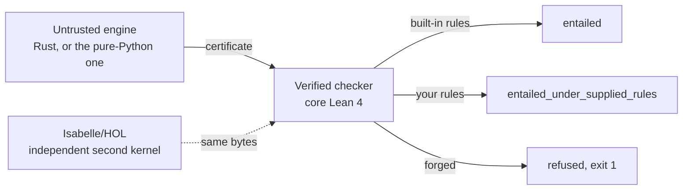

<!-- mcp-name: io.github.fabio-rovai/open-ontologies -->

<p align="center">
  
</p>

<h1 align="center">Open Ontologies</h1>

<p align="center">
  <strong>Plan a change to a production ontology. See every consequence before you apply it.<br>
  Then give the reviewer a proof that they can check without trust in you.</strong><br>
  Open Ontologies is written in Rust. It ships as one binary.
</p>

<p align="center">
  <a href="https://tesseractsemantics.com"><strong>tesseractsemantics.com</strong></a>
</p>

<p align="center">
  <a href="https://tesseractsemantics.com"></a>
  <a href="https://github.com/fabio-rovai/open-ontologies/stargazers"></a>
  <a href="https://github.com/fabio-rovai/open-ontologies/actions/workflows/ci.yml"></a>
  <a href="LICENSE"></a>
  <a href="https://github.com/fabio-rovai/open-ontologies/pkgs/container/open-ontologies"></a>
  <a href="https://github.com/sponsors/fabio-rovai"></a>
</p>

<p align="center">
  <strong>English</strong> · <a href="README.zh-CN.md">简体中文</a>
</p>

<p align="center">
  <a href="https://open-ontologies-try.vercel.app/?sample=epc-sample.csv&auto=1"></a>
</p>

<p align="center">
  <sub>Put in one spreadsheet. Get one ontology, with the evidence for each line. Then change one
  cell, and see the shape find the error. The page runs the released binary.</sub>
</p>

<p align="center">
  <a href="https://tesseractsemantics.com"><b>We build this into a platform &rarr; tesseractsemantics.com</b></a><br>
  <sub>The engine is MIT, and it stays MIT. The platform is the hosted version of the engine.</sub>
</p>

---

<p align="center">
  
</p>

<p align="center">
  <sub><b>426 asserted, 259 certified, 1 rejected.</b> The engine derived the green edges. A Lean 4
  checker then <i>proved</i> them. One certificate holds all 259, and one run of the checker accepts it.
  The red edge is a forged line. The same checker refused that line, gave exit 1, and named the rule.
  The run supplies each count. Nobody writes a count into the caption.</sub>
</p>

<p align="center">
  
</p>

<p align="center">
  <sub><b>The same machinery, on a file from a different group, two times. HQDM ships as two files.</b>
  <code>hqdmTop/hqdmFramework</code> publishes an RDFS file. MagmaCore keeps a copy of that file, byte
  for byte. <code>gchq/HQDM</code> publishes an OWL file. The two files fail different checks. The RDFS
  file has no <code>owl:</code> term and no disjointness axiom. Thus <i>no named class in that file can be
  unsatisfiable</i>. But the file has <b>23</b> terms that it uses as a class and never declares. It has
  <b>12</b> <code>rdfs:range</code> declarations that name a relation and not a class. It also has <b>13</b>
  pairs of names that differ by one final underscore. Three of those pairs have the same domain and the
  same range. The OWL file passes all three checks, and the OWL file is not coherent. The tableaux of
  this engine finds <b>195</b> of its named classes satisfiable. The tableaux cannot decide <b>39</b>.
  HermiT calls exactly those <b>39</b> unsatisfiable, and HermiT is an opinion in the vocabulary of this
  repository. This figure proves nothing, and the figure does not claim a proof. A test computes each
  count again, and the test also computes that intersection. For the source and the method, read
  <a href="docs/assets/hqdm/PROVENANCE.md"><code>docs/assets/hqdm/PROVENANCE.md</code></a>.</sub>
</p>

### One triple. Nothing added, nothing removed, blast radius zero. 901 consequences that were not there before.

```
$ printf 'load base.ttl\nplan proposed.ttl\n' | open-ontologies batch -
#   the whole change:  ex:hasParent rdfs:domain ex:Person

added_classes         0
removed_classes       0
blast_radius          0 triples affected
risk_score            low
                      ────────────────────────────────────────────
conservativity        not_conservative_under_rule_table
new consequences      901          rule table owl-rl, in 0.04s
```

Each number from a shape diff tells you that this change is safe. But the change
gave a new type to each individual that the property already had. **The tool
closes this gap.** A text diff cannot show you the gap. The change is one correct
line, and the text diff is one line long.

**Then give the reviewer the proof.** The run writes a certificate. A different
person re-verifies months later. That person needs no instance of this software
and no network. The command is `oo-cert asserted.tsv derivations.tsv`. The exit
code is 0, and the theorem `OOCert.certificate_sound` covers the result.

**The checker also refuses a forged proof.** Write a false conclusion into the
derivation file. The same checker exits 1 and names the rule that does not hold.
This is the red edge in the figure above. This refusal, and not the headline, is
the part that survives examination.

> **This is not an ontology editor.** Use Protégé to draw class hierarchies. You
> run Open Ontologies on the change, before the change goes to production.
>
> **The tool is like Terraform, and this is on purpose. But the plan is semantic,
> not syntactic.** A text diff is `git diff`, and you have `git diff` already.

You do not need a JVM. You do not need Protégé. The engine speaks MCP to Claude,
to Cursor, and to other clients of that protocol.

## See the engine at work

<p align="center">
  
</p>

Three triples go in, and three triples come out. A person asserted only that
`ex:Northwind` is in a sanctioned jurisdiction. The engine *derived* the need for
enhanced due diligence. A different person can check that derivation. That person
does not have to trust you, or this engine, or the model that wrote the ontology.

Watch the last seconds. Somebody forges one conclusion, and leaves the two
premises exactly as they were. The same checker refuses the conclusion and names
the rule. `oo-horn` printed each line in that terminal for the fixtures in
[`tests/fixtures/horn/supplier/`](tests/fixtures/horn/supplier). A test runs the
checker again. The test fails if the figure and the checker do not agree.

## With a proof, and without a proof

Here is the same question. An ordinary reasoner answers first, and then this
engine answers.

| | An ordinary reasoner | Open Ontologies |
| --- | --- | --- |
| The answer | `Northwind needs enhanced due diligence` | the same answer |
| Why the answer holds | "the reasoner says so" | a certificate that names each rule and each premise |
| Who can check the answer | a second implementation can agree, and some reasoners give an explanation. No verified checker accepts either one | anybody, with a checker that shares no code with the engine |
| If the engine has a defect | a second implementation can disagree. Then you know only that one of the two is wrong | the checker refuses the answer, exit 1 |
| If a person edits the output | you cannot find the edit | the checker refuses it, and names the line and the rule |
| If a rule was yours, not the standard's | the report is the same | a different verdict word, and a test holds that word |
| What an auditor receives | a screenshot | a file that the auditor can check again |
| Guarantee on an unsatisfiability answer | asserted | **none, and the tool says so** |

The last row is the purpose of this project. If the tool measures a property, the
tool says *measured*. If a prover gives an opinion, that opinion never takes the
vocabulary of the checker. Read [what the tool proves, and what it does not
prove](#what-the-tool-proves).

## What the tool does

| Capability | What you get |
| --- | --- |
| Reason over OWL and RDFS | Materialised inferences **and** a derivation certificate that a proved checker accepts |
| Use your own rules | SWRL, RIF Core or a Horn table, evaluated, with a verdict word that says the rules were yours |
| Validate against SHACL | A report from an evaluator with a measurement against the W3C suite, not an assertion of success |
| Ask if something is satisfiable | A finite model, replayed and checked, and not only a yes |
| Ask if something is inconsistent | A refutation, if one is certifiable. If not, an honest opinion from the engine |
| Retrieve a slice for RAG | Entailment preservation for each claim, because 99% coverage can still lose the one triple that mattered |
| Change an ontology in production | Plan, blast radius, risk score, locked IRIs, apply, monitor, drift, rollback |
| Load real data | CSV, JSON, XML, YAML, XLSX, Parquet, PostgreSQL and DuckDB into RDF |
| Give the problem to a prover | TPTP, CLIF, SMT-LIB and LADR from one translation. The tool names and counts what it cannot export |
| Work from an assistant | An MCP server, so Claude or Cursor operates all of it in conversation |

## Run the checker yourself

The repository holds the three files. The output below is the output of the
checker. It shows only the important fields.

```bash
$ cd lean && lake build            # builds the checkers, core Lean 4, no Mathlib
$ F=../tests/fixtures/horn

$ lake exe oo-horn check $F/builtin_rules.tsv $F/asserted.tsv $F/good.tsv
{"ok":true,"verdict":"entailed","theorem":"OOCert.entails_of_builtin_horn",
 "means":"every conclusion is true in every model of the asserted graph"}

$ lake exe oo-horn check $F/builtin_rules.tsv $F/asserted.tsv $F/bad_conclusion.tsv
{"ok":false}                        # one IRI in the conclusion changed. exit 1.

$ lake exe oo-horn check $F/user_rules.tsv $F/asserted.tsv $F/good.tsv
{"ok":true,"verdict":"entailed_under_supplied_rules","theorem":"OOCert.horn_certificate_sound"}
```

The third line is the important one. The inference is the same. But you wrote one
of the rules. Thus the rule is an assumption that the certificate carries, and it
is not a fact that the certificate establishes. The verdict word changes. A test
fails if that word stops changing.



## Run the tool on your own ontology

The repository ships those fixtures. Now do the same steps with a file that you
write. The [Install](#install) section is below. These steps take one minute.

```bash
mkdir /tmp/oo-demo && cd /tmp/oo-demo
cat > coffee.ttl <<'EOF'
@prefix ex:   <http://example.org/> .
@prefix rdfs: <http://www.w3.org/2000/01/rdf-schema#> .

ex:Espresso rdfs:subClassOf ex:Coffee .
ex:Coffee   rdfs:subClassOf ex:Drink .
ex:myCup    a               ex:Espresso .
EOF

export OPEN_ONTOLOGIES_STORAGE_MODE=persistent          # in-memory by default, see below
open-ontologies --data-dir /tmp/oo-demo/store load coffee.ttl
open-ontologies --data-dir /tmp/oo-demo/store reason --profile rdfs --certificate ./cert
```

Three triples go in, and three triples come out. The cup is a Coffee. The cup is
a Drink. Espresso is a subclass of Drink. Each RDFS reasoner can do this much.
The directory that the run wrote is the difference.

```bash
lake exe oo-cert /tmp/oo-demo/cert/asserted.tsv /tmp/oo-demo/cert/derivations.tsv
{"ok":true,"asserted":3,"derivations":3,"theorem":"OOCert.certificate_sound"}
```

Now tell the checker a lie. Keep the premises, and forge one conclusion. The
forged conclusion says that the cup is a Beer:

```bash
cp -r /tmp/oo-demo/cert /tmp/oo-demo/forged
sed -i '' 's|example.org/Drink>\t<http://example.org/myCup>|example.org/Beer>\t<http://example.org/myCup>|' \
  /tmp/oo-demo/forged/derivations.tsv     # GNU sed: drop the '' after -i
lake exe oo-cert /tmp/oo-demo/forged/asserted.tsv /tmp/oo-demo/forged/derivations.tsv
```

```json
{"ok":false,"asserted":3,"derivations":3,"first_rejected":2,"rule":"rdfs9",
 "conclusion":"<http://example.org/myCup> <...#type> <http://example.org/Beer>",
 "premises":["<http://example.org/myCup> <...#type> <http://example.org/Coffee>",
             "<http://example.org/Coffee> <...#subClassOf> <http://example.org/Drink>"]}
```

The exit code is 1. The output gives the number of the bad line. It names the
rule. It also shows the premises, so that you can see that the premises do not
support the conclusion.

### What the proof contains

The proof is two tab-separated files. For the run above, the two files are 1.3 KB.
`asserted.tsv` holds your claims:

```
<ex:myCup>      <rdf:type>          <ex:Espresso>
<ex:Coffee>     <rdfs:subClassOf>   <ex:Drink>
<ex:Espresso>   <rdfs:subClassOf>   <ex:Coffee>
```

`derivations.tsv` holds one line for each step. Each line gives the rule, then
the conclusion, then the premises for that conclusion.

```
rdfs9    <ex:myCup> <rdf:type> <ex:Coffee>              <ex:myCup> <rdf:type> <ex:Espresso>        <ex:Espresso> <rdfs:subClassOf> <ex:Coffee>
rdfs11   <ex:Espresso> <rdfs:subClassOf> <ex:Drink>     <ex:Espresso> <rdfs:subClassOf> <ex:Coffee> <ex:Coffee> <rdfs:subClassOf> <ex:Drink>
rdfs9    <ex:myCup> <rdf:type> <ex:Drink>               <ex:myCup> <rdf:type> <ex:Coffee>          <ex:Coffee> <rdfs:subClassOf> <ex:Drink>
```

That is the full proof. It needs no model, no network and no vendor.

A checker reads each line. For each line, the checker derives the conclusion again
from the premises of that line, under the rule that the line names. The checker
then confirms that each premise is asserted, or that an **earlier** line concluded
it. Anybody can write such a checker. This checker has a soundness theorem.

### Who checks the certificate, and when

The certificate is a file. Thus the person who holds the file can check it, at
any time that they choose.

| Who | When | What they run |
| --- | --- | --- |
| You, in the loop | at each run, before you trust an answer | `lake exe oo-cert`, next to the reasoner |
| A reviewer | when a change lands | the same command in CI, on the artefact that the run wrote |
| An auditor, months later | long after the engine moved on | the same command, on the archived files |
| A different agent | when it receives a claim from an agent that it does not trust | the same command, before it acts on the claim |

The tool streams nothing, and the tool calls no home server. The engine and the
checker share bytes on a disk, and they share no protocol. This is what makes the
last two rows possible. An auditor who checks a claim next year needs the two
files and a Lean build. That auditor does not need an instance of this software.

The certificate records a digest of the assertions that the run used. The file
`asserted.sha256` holds that digest, next to the two other files. A holder of a
store runs `certificate-check <dir>`. The command reads the digest, computes the
same digest from the store, and reports whether the two agree.

That answer has a limit, and the command states the limit. A digest binds a
certificate to bytes. It does not bind a certificate to a state of the world. A
store that changed and then changed back gives the same answer. The type-level
form of this work is [decision
0010](docs/decisions/0010-the-input-is-a-value-and-not-a-store.md), and that
work is open.

One case needs a word, because you will meet it. `reason` writes its inferences
into the store by default. A check after such a run finds more triples in the
store than the certificate lists. The report names that cause, and it does not
call the store a different graph. It says *different graph* only when a triple
in the store is not a conclusion of the run.

Two defaults can cause you trouble. First, storage is in-memory, unless you set
`OPEN_ONTOLOGIES_STORAGE_MODE=persistent`. Thus a `load` and then a `reason`
starts from an empty store, and certifies nothing. The tool gives a warning, and
you can miss that warning easily. Second, `--data-dir` is a flag and not an
environment variable. Thus a demonstration without that flag writes into
`~/.open-ontologies`, next to your real work.

The discipline behind this work has a cost, and the discipline has earned that
cost: [what the rules are, and what each rule caught](docs/decisions/).

## What the tool proves

| You ask | You get back | Checked against |
| --- | --- | --- |
| Reason over OWL | A derivation certificate | `OOCert.certificate_sound` |
| Reason with rules that you wrote | A certificate, and a different verdict word | `OOCert.horn_certificate_sound` |
| Is this satisfiable | A finite model | `Dl.satisfiable_of_checkModel` |
| Is the model of a solver real | The model, replayed | `Fol.satisfiable_of_check` |
| Is this inconsistent | A refutation | `OOCert.refutation_sound` |
| Does this data fit the shapes | A validation report | `Shacl.validate_spec` |
| Does a retrieval slice still support the answer | Preservation for each claim | `OOCert.certificate_sound` |

Read that last row two times. A retrieval slice with 99% coverage can lose the one
triple that an answer needs. A slice with 60% coverage can keep each claim that
matters. Coverage is a proxy, and the proxy rises as the slice grows.

Thus a retriever that you tune on coverage learns to fetch more, and not to fetch
the correct triples. Entailment preservation is the property that you want. The
tool can decide that property here, and it gives one certificate for each claim.
See [decision 0007](docs/decisions/0007-a-slice-preserves-a-conclusion-or-it-does-not.md).

A measurement of the loss is the second-best answer. The best answer is a subset
that can lose nothing. `onto_module_extract` computes such a subset. It computes a
syntactic locality module over a signature. Each entailment of the full ontology
over those terms is also an entailment of the subset.

That guarantee is a theorem of Cuenca Grau, Horrocks, Kazakov and Sattler, JAIR 31
(2008). The tool CITES that
theorem, and no machine checks it here. No file under [lean/](lean/) is about
locality, and the report says exactly that.

The report names no theorem of this project. It offers a measurement instead. It
reasons over the ontology and over the module to a fixpoint. It then reports each
conclusion over the signature that the module does not reach. On the pizza
ontology of this repository, the module is 238 of 1,345 axioms.

The run lost zero conclusions out of 2,583 differences. `onto_conservative_check`
uses the same machinery for the lifecycle. It answers one question: does the
addition of these axioms change any consequence over the names that the ontology
already used? See
[decision 0011](docs/decisions/0011-a-module-carries-a-theorem-and-a-slice-carries-a-measurement.md).

## Install

```bash
# macOS (Apple Silicon)
curl -LO https://github.com/fabio-rovai/open-ontologies/releases/latest/download/open-ontologies-aarch64-apple-darwin
chmod +x open-ontologies-aarch64-apple-darwin && mv open-ontologies-aarch64-apple-darwin /usr/local/bin/open-ontologies

# Linux (x86_64)
curl -LO https://github.com/fabio-rovai/open-ontologies/releases/latest/download/open-ontologies-x86_64-unknown-linux-gnu
chmod +x open-ontologies-x86_64-unknown-linux-gnu && mv open-ontologies-x86_64-unknown-linux-gnu /usr/local/bin/open-ontologies

# Docker
docker pull ghcr.io/fabio-rovai/open-ontologies:latest

# From source (Rust 1.85+)
cargo build --release --features embeddings,plugins,sql
```

For Intel macOS, for native Windows and for other systems, read
[docs/quickstart.md](docs/quickstart.md) and [docs/windows.md](docs/windows.md).

The `serve` command starts an MCP server. That server speaks JSON-RPC on stdin and
stdout. Thus, at start, the server looks as if it stopped, while it waits for a
client. This behaviour is correct. From a terminal, use the CLI subcommands
instead, for example `open-ontologies validate <file.ttl>`.

## Connect the tool to Claude

For Claude Code, add this block to `~/.claude/settings.json`. For Claude Desktop,
add the block to `~/Library/Application Support/Claude/claude_desktop_config.json`:

```json
{
  "mcpServers": {
    "open-ontologies": {
      "command": "/path/to/open-ontologies",
      "args": ["serve"]
    }
  }
}
```

Start the client again, and the `onto_*` tools are available. For Cursor, for
Windsurf, for Zed and for VS Code, read [docs/quickstart.md](docs/quickstart.md).

## Stars

<a href="https://star-history.com/#fabio-rovai/open-ontologies&Date">
  
</a>

## What the box contains

**One loop:** `plan` a change, `apply` the change, watch for `drift`, `certify`
what the engine derived, and `rollback` when the change was wrong. That loop is
the whole of this front page, and that loop is the purpose of the tool.

The other parts have their own documentation and their own code. They are
alignment, embeddings, PDDL planning, clinical crosswalks, the plugin marketplace
and CIVeX. [docs/tool-reference.md](docs/tool-reference.md) lists them one time,
and this page does not list them. A large list of features is not the argument.

Some tools need an optional Cargo feature, and they return an error without that
feature. Four tools need `embeddings`. Two tools need `plugins`. Two tools need
`postgres` or `duckdb`. The published binaries and the GHCR image use the default
feature set. Thus they do not carry those eight tools.

The Python package `open-ontologies-lite` also reasons now. It reasons in pure
Python, and it needs no Rust toolchain. The same Lean binaries check its
certificates. The package is a second engine. The lack of trust in that engine
costs nothing, because the warrant was never in the engine.

`tools/horn_differential.py` runs both engines and the Lean checker over each RDF
document in the repository. **The two engines are not independent.** They run the
same algorithm over the same rule table, and the comments in the Python cite the
Rust by file and by line. Thus their agreement is strong evidence against a
transcription error, and it is almost no evidence against a shared misreading of a
W3C rule. The independent leg is the Lean checker. The tool prints that caveat
next to its agreement count at each run.
[docs/lean-certificates.md](docs/lean-certificates.md#known-limitations) also
states the caveat as a limitation.

With those parts, the repository holds a marketplace of 33 standard ontologies,
clinical crosswalks, semantic embeddings and a lineage audit trail. It also holds
a desktop Studio, with a virtualized ontology tree, an AI chat panel and an
inspector in the style of Protégé. You need no JVM. You need no Protégé.

## Documentation

| Topic | Link |
| --- | --- |
| Quickstart | [docs/quickstart.md](docs/quickstart.md) |
| Architecture | [docs/architecture.md](docs/architecture.md) |
| Derivation certificates and the Lean checkers | [docs/lean-certificates.md](docs/lean-certificates.md) |
| Which axioms a conclusion rests on, and provenance semirings | [docs/explanation.md](docs/explanation.md) |
| What the Lean proofs assume about the Rust | [docs/trusted-computing-base.md](docs/trusted-computing-base.md) |
| Aeneas at the Rust and Lean boundary: what it proves, and what it costs | [docs/aeneas-boundary.md](docs/aeneas-boundary.md) |
| Which gates a green CI tick ran | [docs/ci-gates.md](docs/ci-gates.md) |
| First-order export, TPTP and Common Logic | [docs/first-order-export.md](docs/first-order-export.md) |
| Each reasoning system, and why the project used or refused it | [docs/reasoning-systems-inventory.md](docs/reasoning-systems-inventory.md) |
| Design decisions, one rule for each file | [docs/decisions/](docs/decisions/) |
| SHIQ reasoning | [docs/reasoning.md](docs/reasoning.md) |
| Schema alignment | [docs/alignment.md](docs/alignment.md) |
| Data pipeline | [docs/data-pipeline.md](docs/data-pipeline.md) |
| Ontology lifecycle | [docs/lifecycle.md](docs/lifecycle.md) |
| Locality modules and conservative extensions | [docs/modules-and-conservativity.md](docs/modules-and-conservativity.md) |
| Semantic embeddings | [docs/embeddings.md](docs/embeddings.md) |
| Clinical crosswalks | [docs/clinical.md](docs/clinical.md) |
| IES support | [ecosystem](docs/ies-ecosystem.md) · [alignment](docs/ies-alignment.md) · [SPARQL examples](docs/ies-examples.md) |
| Benchmarks | [docs/benchmarks.md](docs/benchmarks.md) |
| Determinism and corrected results | [docs/determinism.md](docs/determinism.md) |
| Windows | [docs/windows.md](docs/windows.md) |
| Contributing | [CONTRIBUTING.md](CONTRIBUTING.md) |

## Open Ontologies for teams

The engine in this repository has an MIT licence, and it keeps that licence. The
engine does not give you a place for the evidence. You need a place that keeps
certificates. You need a review of each change to an ontology, before that change
ships. You need an auditor who can check an answer again, months later, with no
installation.

We build [**tesseractsemantics.com**](https://tesseractsemantics.com) for that
purpose. If a wrong answer from your ontologies has a cost, a conversation is
worth your time.

<p align="center">
  <a href="https://tesseractsemantics.com"><b>tesseractsemantics.com &rarr;</b></a>
</p>

## Stack

Rust edition 2024, one binary, no JVM. Oxigraph 0.5 for RDF and for SPARQL 1.1.
`rmcp` for MCP over streamable HTTP. SQLite for state, for lineage and for
feedback. Lean 4 v4.33.1 for the checkers, core Lean only, no Mathlib.

Tauri 2, React 19 and Tailwind 4 for the Studio. The full table is in
[docs/architecture.md](docs/architecture.md).

## Citation

- **Open Ontologies: Tool-Augmented Ontology Engineering with Stable Matching Alignment.** Fabio
  Rovai, 2026. [arXiv:2605.09184](https://arxiv.org/abs/2605.09184)
- **CIVeX: Causal Intervention Verification for Language Agents.** Fabio Rovai, 2026.
  [arXiv:2605.09168](https://arxiv.org/abs/2605.09168)

[`CITATION.cff`](CITATION.cff) holds machine-readable metadata. It also operates
the "Cite this repository" button of GitHub.

## Language of this page

This page follows the writing rules of ASD-STE100 Simplified Technical English.
The rules are one idea for each sentence, the active voice and simple tenses. A
descriptive sentence has a maximum of 25 words. A paragraph has a maximum of 6
sentences. The same term always keeps the same meaning.

`tests/readme_simplified_english_test.rs` measures those rules. That test fails
the build if this page breaks them. The same test holds the translated page to
the structure of this one.

The official STE dictionary of approved words is a licensed document, and this
project does not hold a copy. Thus this page claims the writing rules only. It
does not claim approved-word compliance. The technical names and technical verbs
of this domain stay in use. Examples are *ontology*, *triple*, *reason* and
*certify*. STE permits such terms for a technical domain.

## License

MIT. [Fabio Rovai](https://github.com/fabio-rovai) maintains this project at
[Tesseract Semantics](https://tesseractsemantics.com). If this project is useful
to you, you can support it through
[GitHub Sponsors](https://github.com/sponsors/fabio-rovai).
