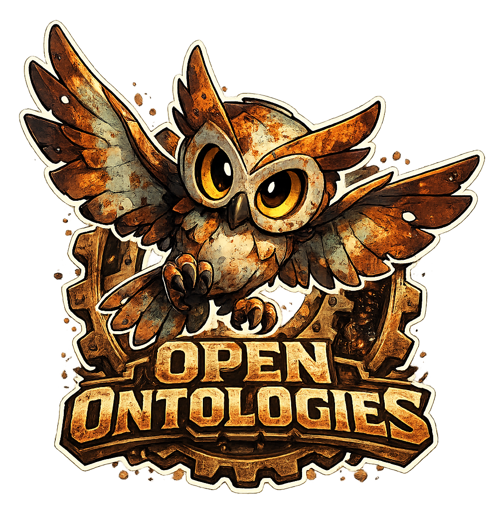
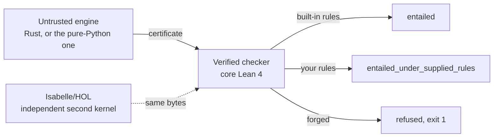

<p align="center">
  
</p>

<h1 align="center">Open Ontologies</h1>

<p align="center">
  <strong>为生产环境中的本体规划一次变更。在应用之前看清每一项后果。<br>
  然后交给审阅者一份无需信任你即可自行核验的证明。</strong><br>
  Open Ontologies 使用 Rust 编写，以单一可执行文件发布。
</p>

<p align="center">
  <a href="https://tesseractsemantics.com"><strong>tesseractsemantics.com</strong></a>
</p>

<p align="center">
  <a href="https://tesseractsemantics.com"></a>
  <a href="https://github.com/fabio-rovai/open-ontologies/stargazers"></a>
  <a href="https://github.com/fabio-rovai/open-ontologies/actions/workflows/ci.yml"></a>
  <a href="LICENSE"></a>
  <a href="https://github.com/fabio-rovai/open-ontologies/pkgs/container/open-ontologies"></a>
  <a href="https://github.com/sponsors/fabio-rovai"></a>
</p>

<p align="center">
  <a href="README.md">English</a> · <strong>简体中文</strong>
</p>

<p align="center">
  <a href="https://open-ontologies-try.vercel.app/?sample=epc-sample.csv&auto=1&lang=zh"></a>
</p>

<p align="center">
  <sub>放入一张表格。得到一个本体，以及每一行的证据。然后改动一个单元格，看形状把错误找出来。
  该页面运行的是发布版可执行文件。</sub>
</p>

<p align="center">
  <a href="https://tesseractsemantics.com"><b>我们把它建成一个平台 &rarr; tesseractsemantics.com</b></a><br>
  <sub>引擎采用 MIT 许可，并且保持 MIT。平台是该引擎的托管版本。</sub>
</p>

---

<p align="center">
  
</p>

<p align="center">
  <sub><b>426 条断言，259 条已认证，1 条被拒绝。</b>绿色边由引擎推导得出。随后一个 Lean 4
  检查器<i>证明</i>了它们。一份证书涵盖全部 259 条，检查器一次运行即可接受它。
  红色边是一行伪造的内容。同一个检查器拒绝了它，以 exit 1 退出，并指出了规则。
  每个数字都来自运行结果。没有人把数字写进说明文字。</sub>
</p>

<p align="center">
  
</p>

<p align="center">
  <sub><b>同一套机制，用在别人的文件上，而且用了两次。HQDM 以两个文件发布。</b>
  <code>hqdmTop/hqdmFramework</code> 发布一个 RDFS 文件。MagmaCore 逐字节保存了该文件的副本。
  <code>gchq/HQDM</code> 发布一个 OWL 文件。这两个文件未通过的检查各不相同。RDFS 文件没有
  <code>owl:</code> 术语，也没有不相交公理。因此<i>该文件中没有任何具名类可能不可满足</i>。
  但是该文件有 <b>23</b> 个被它当作类使用、却从未声明的术语。它有 <b>12</b> 条把关系而不是类
  写成 <code>rdfs:range</code> 的声明。它还有 <b>13</b> 对仅相差一个尾部下划线的名称。其中 3
  对具有相同的定义域和相同的值域。OWL 文件通过了全部三项检查，而 OWL 文件并不融贯。本引擎的
  tableaux 判定其 <b>195</b> 个具名类可满足。该 tableaux 无法判定 <b>39</b> 个。HermiT 恰好把这
  <b>39</b> 个判为不可满足，而在本仓库的词汇中，HermiT 只是一种意见。这张图没有证明任何东西，
  图中也没有宣称有证明。一个测试重新计算每个数字，该测试也重新计算这一交集。关于来源与方法，请阅读
  <a href="docs/assets/hqdm/PROVENANCE.md"><code>docs/assets/hqdm/PROVENANCE.md</code></a>。</sub>
</p>

### 一条三元组。没有增加，没有删除，影响半径为零。901 条此前不存在的后果。

```
$ printf 'load base.ttl\nplan proposed.ttl\n' | open-ontologies batch -
#   the whole change:  ex:hasParent rdfs:domain ex:Person

added_classes         0
removed_classes       0
blast_radius          0 triples affected
risk_score            low
                      ────────────────────────────────────────────
conservativity        not_conservative_under_rule_table
new consequences      901          rule table owl-rl, in 0.04s
```

形状差异给出的每个数字都告诉你，这次变更是安全的。但是这次变更给该属性已有的每一个个体
都加上了一个新类型。**本工具填补的正是这个缺口。**文本差异无法向你显示这个缺口。变更只有
一行，而且写法正确，文本差异也只有一行长。

**然后把证明交给审阅者。**该次运行写出一份证书。另一个人在数月之后重新核验。那个人不需要
本软件的任何运行实例，也不需要网络。命令是 `oo-cert asserted.tsv derivations.tsv`。退出码
为 0，定理 `OOCert.certificate_sound` 覆盖这一结果。

**检查器也会拒绝伪造的证明。**把一条错误的结论写进推导文件。同一个检查器以 exit 1 退出，
并指出那条不成立的规则。这就是上图中的红色边。经得起审视的，是这次拒绝，而不是标题。

> **这不是一个本体编辑器。**要绘制类层次结构，请使用 Protégé。你在变更进入生产环境之前，
> 对这次变更运行 Open Ontologies。
>
> **本工具在风格上类似 Terraform，这是刻意为之。但是这里的计划是语义层面的，不是语法层面的。**
> 文本差异就是 `git diff`，而你已经有 `git diff` 了。

你不需要 JVM。你不需要 Protégé。引擎通过 MCP 与 Claude、Cursor 以及该协议的其他客户端通信。

## 看引擎如何工作

<p align="center">
  
</p>

三条三元组进去，三条三元组出来。有人只断言了 `ex:Northwind` 位于一个受制裁的司法管辖区。
引擎*推导*出它需要强化尽职调查。另一个人可以检查该推导。那个人不必信任你，不必信任本引擎，
也不必信任写出该本体的模型。

请看最后几秒。有人伪造了一条结论，并且原样保留了两条前提。同一个检查器拒绝了该结论，并指出
了规则。那个终端中的每一行，都是 `oo-horn` 针对
[`tests/fixtures/horn/supplier/`](tests/fixtures/horn/supplier) 中的夹具实际打印的内容。
一个测试会再次运行该检查器。如果图和检查器不一致，该测试就失败。

## 有证明，和没有证明

下面是同一个问题。先由一个普通推理机回答，然后由本引擎回答。

| | 普通推理机 | Open Ontologies |
| --- | --- | --- |
| 答案 | `Northwind needs enhanced due diligence` | 同样的答案 |
| 答案为何成立 | “推理机这样说” | 一份证书，其中指明每条规则和每条前提 |
| 谁能检查答案 | 第二个实现可以表示同意，有些推理机会给出解释。没有经过验证的检查器接受其中任何一种 | 任何人，用一个与引擎不共享任何代码的检查器 |
| 如果引擎有缺陷 | 第二个实现可能给出不同结果。那时你只知道两者之一是错的 | 检查器拒绝该答案，exit 1 |
| 如果有人编辑了输出 | 你找不到这次编辑 | 检查器拒绝它，并指出行号和规则 |
| 如果某条规则是你写的，而不是标准里的 | 报告完全相同 | 一个不同的结论词，并且有测试守住这个词 |
| 审计人员收到什么 | 一张截图 | 一个他们可以再次核验的文件 |
| 对“不可满足”这一答案的保证 | 断言 | **没有保证，而且工具明说这一点** |

最后一行就是本项目的目的。如果工具测量了一个性质，工具就说*测量*。如果一个证明器给出的是
意见，那个意见绝不会借用检查器的词汇。请阅读[本工具证明了什么，没有证明什么](#本工具证明了什么)。

## 本工具能做什么

| 能力 | 你得到什么 |
| --- | --- |
| 在 OWL 和 RDFS 上推理 | 物化的推论，**并且**有一份经过证明的检查器所接受的推导证书 |
| 使用你自己的规则 | SWRL、RIF Core 或 Horn 规则表，经过求值，并用一个结论词说明这些规则是你的 |
| 依据 SHACL 校验 | 一份来自求值器的报告，附带针对 W3C 测试集的测量，而不是对通过的断言 |
| 询问某物是否可满足 | 一个有限模型，经过重放和检查，而不仅仅是一个“是” |
| 询问某物是否不一致 | 一份反驳，前提是它可被认证。如果不可，则是引擎的一个诚实意见 |
| 为 RAG 取出一个切片 | 针对每条主张的蕴涵保持，因为 99% 的覆盖率仍然可能丢掉那条关键的三元组 |
| 在生产环境中修改本体 | 计划、影响半径、风险分数、锁定的 IRI、应用、监控、漂移、回滚 |
| 载入真实数据 | CSV、JSON、XML、YAML、XLSX、Parquet、PostgreSQL 和 DuckDB 转为 RDF |
| 把问题交给证明器 | 由一次翻译得到 TPTP、CLIF、SMT-LIB 和 LADR。工具会指明并计数它无法导出的部分 |
| 从助手中使用 | 一个 MCP 服务器，因此 Claude 或 Cursor 可以在对话中操作全部功能 |

## 自己运行检查器

本仓库中有这三个文件。下面的输出就是检查器的输出，只保留了重要的字段。

```bash
$ cd lean && lake build            # builds the checkers, core Lean 4, no Mathlib
$ F=../tests/fixtures/horn

$ lake exe oo-horn check $F/builtin_rules.tsv $F/asserted.tsv $F/good.tsv
{"ok":true,"verdict":"entailed","theorem":"OOCert.entails_of_builtin_horn",
 "means":"every conclusion is true in every model of the asserted graph"}

$ lake exe oo-horn check $F/builtin_rules.tsv $F/asserted.tsv $F/bad_conclusion.tsv
{"ok":false}                        # one IRI in the conclusion changed. exit 1.

$ lake exe oo-horn check $F/user_rules.tsv $F/asserted.tsv $F/good.tsv
{"ok":true,"verdict":"entailed_under_supplied_rules","theorem":"OOCert.horn_certificate_sound"}
```

第三行是重要的一行。推理是同一个推理。但是其中一条规则是你写的。因此该规则是证书所承载的
一个假设，而不是证书所确立的一个事实。结论词发生了变化。如果那个词不再变化，一个测试就失败。



## 在你自己的本体上运行本工具

本仓库随附那些夹具。现在用一个你自己写的文件做同样的步骤。[安装](#安装)一节在下面。
这些步骤需要一分钟。

```bash
mkdir /tmp/oo-demo && cd /tmp/oo-demo
cat > coffee.ttl <<'EOF'
@prefix ex:   <http://example.org/> .
@prefix rdfs: <http://www.w3.org/2000/01/rdf-schema#> .

ex:Espresso rdfs:subClassOf ex:Coffee .
ex:Coffee   rdfs:subClassOf ex:Drink .
ex:myCup    a               ex:Espresso .
EOF

export OPEN_ONTOLOGIES_STORAGE_MODE=persistent          # in-memory by default, see below
open-ontologies --data-dir /tmp/oo-demo/store load coffee.ttl
open-ontologies --data-dir /tmp/oo-demo/store reason --profile rdfs --certificate ./cert
```

三条三元组进去，三条三元组出来。杯子是 Coffee。杯子是 Drink。Espresso 是 Drink 的子类。
每个 RDFS 推理机都能做到这一步。差别在于该次运行写出的那个目录。

```bash
lake exe oo-cert /tmp/oo-demo/cert/asserted.tsv /tmp/oo-demo/cert/derivations.tsv
{"ok":true,"asserted":3,"derivations":3,"theorem":"OOCert.certificate_sound"}
```

现在对检查器说谎。保留前提，伪造一条结论。这条伪造的结论说杯子是 Beer：

```bash
cp -r /tmp/oo-demo/cert /tmp/oo-demo/forged
sed -i '' 's|example.org/Drink>\t<http://example.org/myCup>|example.org/Beer>\t<http://example.org/myCup>|' \
  /tmp/oo-demo/forged/derivations.tsv     # GNU sed: drop the '' after -i
lake exe oo-cert /tmp/oo-demo/forged/asserted.tsv /tmp/oo-demo/forged/derivations.tsv
```

```json
{"ok":false,"asserted":3,"derivations":3,"first_rejected":2,"rule":"rdfs9",
 "conclusion":"<http://example.org/myCup> <...#type> <http://example.org/Beer>",
 "premises":["<http://example.org/myCup> <...#type> <http://example.org/Coffee>",
             "<http://example.org/Coffee> <...#subClassOf> <http://example.org/Drink>"]}
```

退出码是 1。输出给出错误行的行号。它指出规则。它还显示前提，好让你自己看到这些前提并不
支持该结论。

### 证明里有什么

证明是两个以制表符分隔的文件。对于上面那次运行，两个文件共 1.3 KB。`asserted.tsv` 保存
你的声称：

```
<ex:myCup>      <rdf:type>          <ex:Espresso>
<ex:Coffee>     <rdfs:subClassOf>   <ex:Drink>
<ex:Espresso>   <rdfs:subClassOf>   <ex:Coffee>
```

`derivations.tsv` 为每一步保存一行。每行给出规则，然后是结论，然后是该结论所用的前提。

```
rdfs9    <ex:myCup> <rdf:type> <ex:Coffee>              <ex:myCup> <rdf:type> <ex:Espresso>        <ex:Espresso> <rdfs:subClassOf> <ex:Coffee>
rdfs11   <ex:Espresso> <rdfs:subClassOf> <ex:Drink>     <ex:Espresso> <rdfs:subClassOf> <ex:Coffee> <ex:Coffee> <rdfs:subClassOf> <ex:Drink>
rdfs9    <ex:myCup> <rdf:type> <ex:Drink>               <ex:myCup> <rdf:type> <ex:Coffee>          <ex:Coffee> <rdfs:subClassOf> <ex:Drink>
```

这就是完整的证明。它不需要模型，不需要网络，也不需要厂商。检查器读取每一行。对每一行，
检查器依据该行所指的规则，从该行的前提重新推导出结论。然后检查器确认每条前提要么是断言，
要么是**更早**的某一行得出的结论。任何人都可以写这样一个检查器。本检查器带有一个可靠性定理。

### 谁来检查证书，什么时候检查

证书是一个文件。因此持有该文件的人可以检查它，时间由他们自己选择。

| 谁 | 何时 | 他们运行什么 |
| --- | --- | --- |
| 你，在流程之中 | 每次运行时，在你信任一个答案之前 | `lake exe oo-cert`，在推理机旁边运行 |
| 审阅者 | 当一次变更合入时 | 在 CI 中运行同一条命令，对象是该次运行写出的产物 |
| 审计人员，数月之后 | 在引擎早已向前演进之后 | 同一条命令，对象是归档的文件 |
| 另一个智能体 | 当它收到一个来自它不信任的智能体的主张时 | 同一条命令，在它据此行动之前 |

本工具不做流式传输，也不回连任何服务器。引擎和检查器共享磁盘上的字节，而不共享协议。
正是这一点使最后两行成为可能。一个在明年重新检查某个主张的审计人员，需要的是那两个文件
和一次 Lean 构建。那位审计人员不需要本软件的运行实例。

证书会记录该次运行所用断言的摘要。文件 `asserted.sha256` 保存这个摘要，就在另外两个文件
旁边。持有某个存储的人运行 `certificate-check <dir>`。该命令读取这个摘要，从存储中计算出
同样的摘要，并报告两者是否一致。

这个答案有一个界限，而该命令会说明这个界限。摘要把证书绑定到字节，而不是绑定到世界的某个
状态。一个先改变、后又改回去的存储会给出同样的答案。这项工作的类型层面形式是[决策
0010](docs/decisions/0010-the-input-is-a-value-and-not-a-store.md)，那部分工作仍然开放。

有一种情况需要说明，因为你一定会遇到。`reason` 默认把推论写入存储。在这样一次运行之后做
检查，会发现存储中的三元组比证书列出的更多。报告会指出这个原因，并且不会把该存储称作另一
个图。只有当存储中的某条三元组不是该次运行的结论时，它才说*另一个图*。

有两个默认设置可能给你带来麻烦。第一，除非你设置
`OPEN_ONTOLOGIES_STORAGE_MODE=persistent`，否则存储是内存存储。因此先 `load` 再 `reason`
是从一个空存储开始的，并且认证不了任何东西。工具会给出警告，而你很容易忽略那条警告。
第二，`--data-dir` 是一个命令行标志，不是环境变量。因此不带该标志的演示会写入
`~/.open-ontologies`，就在你真正的工作旁边。

这套纪律是有代价的，而这套纪律已经挣回了这个代价：
[规则是什么，以及每条规则抓到了什么](docs/decisions/)。

## 本工具证明了什么

| 你问什么 | 你得到什么 | 对照什么检查 |
| --- | --- | --- |
| 在 OWL 上推理 | 一份推导证书 | `OOCert.certificate_sound` |
| 用你写的规则推理 | 一份证书，以及一个不同的结论词 | `OOCert.horn_certificate_sound` |
| 这是可满足的吗 | 一个有限模型 | `Dl.satisfiable_of_checkModel` |
| 某个求解器的模型是真的吗 | 该模型，经过重放 | `Fol.satisfiable_of_check` |
| 这是不一致的吗 | 一份反驳 | `OOCert.refutation_sound` |
| 这些数据符合这些形状吗 | 一份校验报告 | `Shacl.validate_spec` |
| 一个检索切片是否仍然支持该答案 | 针对每条主张的保持 | `OOCert.certificate_sound` |

最后一行请读两遍。一个覆盖率 99% 的检索切片，可能丢掉某个答案所需要的那条三元组。一个覆盖率
60% 的切片，可能保住每一条重要的主张。覆盖率是一个代理指标，而这个代理指标随切片变大而上升。

因此，你用覆盖率去调优的检索器，学会的是取回更多，而不是取回正确的三元组。蕴涵保持才是你想要
的性质。本工具在这里可以判定该性质，并且为每条主张给出一份证书。参见
[决策 0007](docs/decisions/0007-a-slice-preserves-a-conclusion-or-it-does-not.md)。

对损失的测量是次好的答案。最好的答案是一个不可能丢失任何东西的子集。`onto_module_extract`
计算这样一个子集。它在一个签名之上计算语法局部性模块。完整本体在那些术语上的每一条蕴涵，
也是该子集的一条蕴涵。

这个保证是 Cuenca Grau、Horrocks、Kazakov 和 Sattler 的一个定理，JAIR 31 (2008)。本工具
*引用*该定理，这里没有任何机器检查它。[lean/](lean/) 下没有任何文件是关于局部性的，报告
也正是这样说的。

报告不提及本项目的任何定理。它转而给出一个测量。它把本体和模块都推理到不动点。然后它报告
模块在该签名上没有到达的每一条结论。在本仓库自己的 pizza 本体上，模块是 1,345 条公理中的
238 条。

该次运行在检查的 2,583 处差异中丢失了零条结论。`onto_conservative_check` 把同一套机制用于
生命周期。它回答一个问题：增加这些公理，是否改变了本体已经使用的那些名称之上的任何后果？参见
[决策 0011](docs/decisions/0011-a-module-carries-a-theorem-and-a-slice-carries-a-measurement.md)。

## 安装

```bash
# macOS (Apple Silicon)
curl -LO https://github.com/fabio-rovai/open-ontologies/releases/latest/download/open-ontologies-aarch64-apple-darwin
chmod +x open-ontologies-aarch64-apple-darwin && mv open-ontologies-aarch64-apple-darwin /usr/local/bin/open-ontologies

# Linux (x86_64)
curl -LO https://github.com/fabio-rovai/open-ontologies/releases/latest/download/open-ontologies-x86_64-unknown-linux-gnu
chmod +x open-ontologies-x86_64-unknown-linux-gnu && mv open-ontologies-x86_64-unknown-linux-gnu /usr/local/bin/open-ontologies

# Docker
docker pull ghcr.io/fabio-rovai/open-ontologies:latest

# From source (Rust 1.85+)
cargo build --release --features embeddings,plugins,sql
```

关于 Intel macOS、原生 Windows 以及其他系统，请阅读
[docs/quickstart.md](docs/quickstart.md) 和 [docs/windows.md](docs/windows.md)。

`serve` 命令启动一个 MCP 服务器。该服务器在 stdin 和 stdout 上使用 JSON-RPC。因此在启动时，
服务器看上去像是停住了，其实它在等待客户端。这个行为是正确的。在终端里，请改用 CLI 子命令，
例如 `open-ontologies validate <file.ttl>`。

## 把本工具接入 Claude

对于 Claude Code，把下面这段加入 `~/.claude/settings.json`。对于 Claude Desktop，把它加入
`~/Library/Application Support/Claude/claude_desktop_config.json`：

```json
{
  "mcpServers": {
    "open-ontologies": {
      "command": "/path/to/open-ontologies",
      "args": ["serve"]
    }
  }
}
```

重新启动客户端，`onto_*` 工具即可使用。关于 Cursor、Windsurf、Zed 和 VS Code，请阅读
[docs/quickstart.md](docs/quickstart.md)。

## Star 数

<a href="https://star-history.com/#fabio-rovai/open-ontologies&Date">
  
</a>

## 盒子里有什么

**一个闭环：**`plan` 一次变更，`apply` 该变更，监视 `drift`，对引擎推导出的内容执行
`certify`，在变更错误时执行 `rollback`。这个闭环就是整个首页的内容，也是本工具的目的。

其他部分有自己的文档和自己的代码。它们是对齐、嵌入、PDDL 规划、临床交叉映射、插件市场
和 CIVeX。[docs/tool-reference.md](docs/tool-reference.md) 把它们列出一次，本页面不再列出。
功能数量多本身并不是论据。

有些工具需要一个可选的 Cargo feature，缺少该 feature 时它们返回错误。四个工具需要
`embeddings`。两个工具需要 `plugins`。两个工具需要 `postgres` 或 `duckdb`。已发布的可执行
文件和 GHCR 镜像使用默认 feature 集。因此它们不带那八个工具。

Python 包 `open-ontologies-lite` 现在也能推理。它用纯 Python 推理，不需要 Rust 工具链。
同样的 Lean 可执行文件检查它的证书。该包是第二个引擎。不信任那个引擎没有任何代价，因为
保证从来就不在引擎里。

`tools/horn_differential.py` 让两个引擎和 Lean 检查器在本仓库跟踪的每一份 RDF 文档上运行。
**这两个引擎并不独立。**它们在同一张规则表上运行同一个算法，而且 Python 中的注释按文件和
行号引用 Rust。因此它们的一致是反对转录错误的有力证据，而对于共同误读某条 W3C 规则几乎不是
证据。独立的一条腿是 Lean 检查器。工具在每次运行时都会把这条注意事项打印在一致数量旁边。
[docs/lean-certificates.md](docs/lean-certificates.md#known-limitations) 也把它列为一项限制。

除了这些部分，本仓库还有一个包含 33 个标准本体的市场、临床交叉映射、语义嵌入和一条血缘审计
轨迹。它还有一个桌面 Studio，其中包含虚拟化的本体树、一个 AI 聊天面板，以及一个 Protégé
风格的检查器。你不需要 JVM。你不需要 Protégé。

## 文档

| 主题 | 链接 |
| --- | --- |
| 快速开始 | [docs/quickstart.md](docs/quickstart.md) |
| 架构 | [docs/architecture.md](docs/architecture.md) |
| 推导证书与 Lean 检查器 | [docs/lean-certificates.md](docs/lean-certificates.md) |
| 一个结论依赖哪些公理，以及来源半环 | [docs/explanation.md](docs/explanation.md) |
| Lean 证明对 Rust 作了哪些假设 | [docs/trusted-computing-base.md](docs/trusted-computing-base.md) |
| Rust 与 Lean 边界上的 Aeneas：它证明什么，代价是什么 | [docs/aeneas-boundary.md](docs/aeneas-boundary.md) |
| 绿色的 CI 勾实际运行了哪些门禁 | [docs/ci-gates.md](docs/ci-gates.md) |
| 一阶导出、TPTP 与 Common Logic | [docs/first-order-export.md](docs/first-order-export.md) |
| 每一个推理系统，以及项目为何采用或拒绝它 | [docs/reasoning-systems-inventory.md](docs/reasoning-systems-inventory.md) |
| 设计决策，每个文件一条规则 | [docs/decisions/](docs/decisions/) |
| SHIQ 推理 | [docs/reasoning.md](docs/reasoning.md) |
| 模式对齐 | [docs/alignment.md](docs/alignment.md) |
| 数据管线 | [docs/data-pipeline.md](docs/data-pipeline.md) |
| 本体生命周期 | [docs/lifecycle.md](docs/lifecycle.md) |
| 局部性模块与保守扩展 | [docs/modules-and-conservativity.md](docs/modules-and-conservativity.md) |
| 语义嵌入 | [docs/embeddings.md](docs/embeddings.md) |
| 临床交叉映射 | [docs/clinical.md](docs/clinical.md) |
| IES 支持 | [生态](docs/ies-ecosystem.md) · [对齐](docs/ies-alignment.md) · [SPARQL 示例](docs/ies-examples.md) |
| 基准测试 | [docs/benchmarks.md](docs/benchmarks.md) |
| 确定性与更正后的结果 | [docs/determinism.md](docs/determinism.md) |
| Windows | [docs/windows.md](docs/windows.md) |
| 参与贡献 | [CONTRIBUTING.md](CONTRIBUTING.md) |

## 面向团队的 Open Ontologies

本仓库中的引擎采用 MIT 许可，并且保持该许可。引擎没有给你一个存放证据的地方。你需要一个
保存证书的地方。你需要在每次本体变更发布之前对它进行审阅。你需要一位审计人员，他能在数月
之后无需任何安装就重新检查一个答案。

我们为此建设 [**tesseractsemantics.com**](https://tesseractsemantics.com)。如果你的本体给出
错误答案是有代价的，那么一次交流值得你花时间。

<p align="center">
  <a href="https://tesseractsemantics.com"><b>tesseractsemantics.com &rarr;</b></a>
</p>

## 技术栈

Rust edition 2024，单一可执行文件，无 JVM。Oxigraph 0.5 用于 RDF 和 SPARQL 1.1。`rmcp` 用于
基于 streamable HTTP 的 MCP。SQLite 用于状态、血缘和反馈。Lean 4 v4.33.1 用于检查器，只用
核心 Lean，不用 Mathlib。

Tauri 2、React 19 和 Tailwind 4 用于 Studio。完整表格见
[docs/architecture.md](docs/architecture.md)。

## 引用

- **Open Ontologies: Tool-Augmented Ontology Engineering with Stable Matching Alignment.** Fabio
  Rovai, 2026. [arXiv:2605.09184](https://arxiv.org/abs/2605.09184)
- **CIVeX: Causal Intervention Verification for Language Agents.** Fabio Rovai, 2026.
  [arXiv:2605.09168](https://arxiv.org/abs/2605.09168)

[`CITATION.cff`](CITATION.cff) 保存机器可读的元数据。它也驱动 GitHub 的“引用此仓库”按钮。

## 本页面的语言

英文页面遵循 ASD-STE100 简化技术英语的写作规则。本页面是那一页的中文版本，内容相同：
同样的章节，同样的图，同样的数字。

两张图各有一个中文版本，由同一个生成器产生：`knowledge-graph.zh-CN.svg` 和
`hqdm-audit.zh-CN.svg`。图中的数字不来自翻译。它们由运行结果计算得出，然后填入翻译好的句子，
因此中文版本不可能说出数据不支持的数字。`tests/readme_simplified_english_test.rs` 要求本页面
与英文页面在结构上一致。

## 许可

MIT。[Fabio Rovai](https://github.com/fabio-rovai) 在
[Tesseract Semantics](https://tesseractsemantics.com) 维护本项目。如果本项目对你有用，
你可以通过 [GitHub Sponsors](https://github.com/sponsors/fabio-rovai) 支持它。
